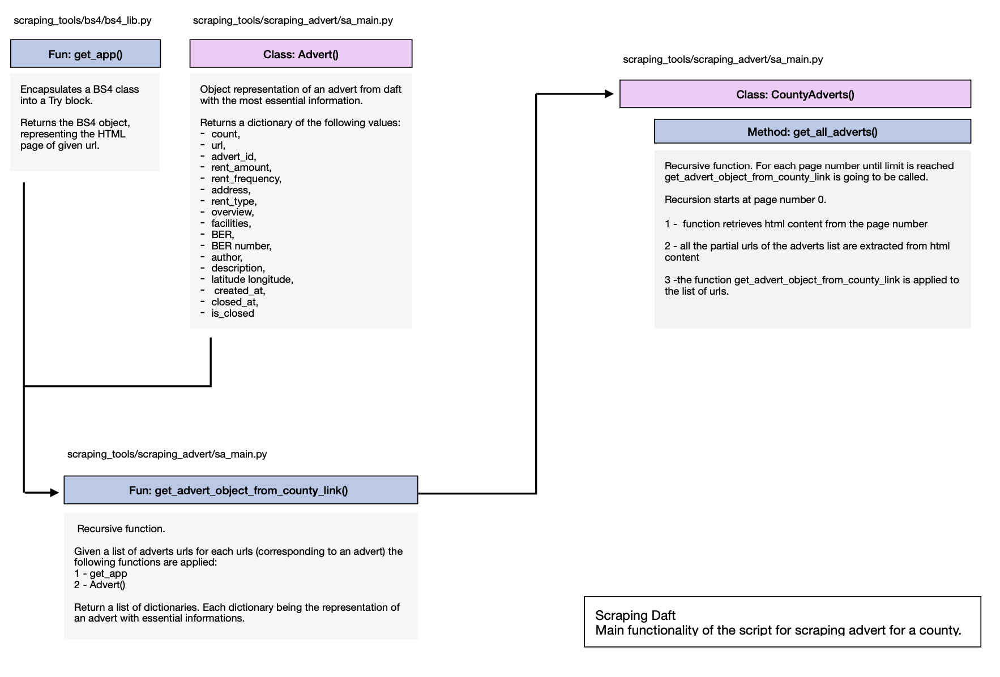

# Scraping Daft

## The genesis of the Project

Lately, my partner, our dog and I had to look for a new place to live in Cork Ireland. Whoever has experienced living in Ireland knows the hassles of such a venture.

Rent runs high for lettings with a quality far from optimal. In November 2021 a deep analysis of the Housing Market has been published by the Irish Government. This study is very complete and provides a deep understanding of the Irish housing market.
I thought it would be interesting to compare their observation with our own findings especially by focusing on an individual aspect through the access to the rental house market.

## The project

People when looking for a house mainly goes to one website Daft.com. There is, unfortunately, no accessible data regarding rent advertisements. The first step of this project was to remedy this by creating a database.

This project runs on Docker, it uses Airflow to run Spark jobs. Basically, for each county, Airflow is used to schedule everyday tasks. It consists of scraping a webpage and persisting the data in a database (PostgreSQL). Every time, the data has been successfully persisted in the database a notification is sent to a dedicated slack channel.

## Running the Project

### Instruction

#### Initiating the Project

```linux
sh init-project.sh
```

#### Stopping the project

```linux
sh kill-project.sh
```

## Some Insights

### the script to scrapt advert for a county


